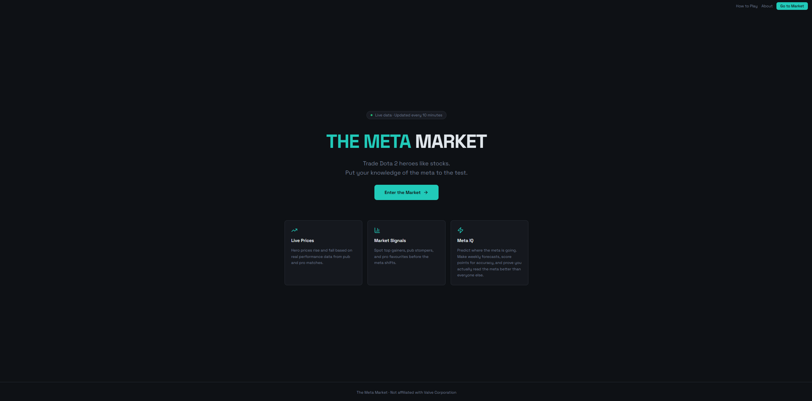
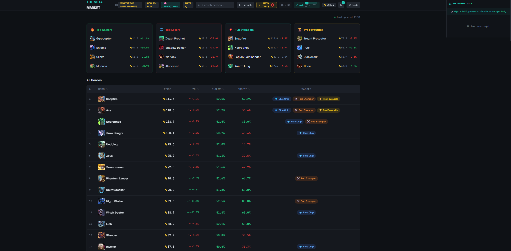

# Meta Market Showcase

Meta Market is a live Dota 2 virtual stock market where heroes are treated like tradable assets.

The idea is simple: Dota players already talk about heroes being broken, underrated, dead in the meta or about to rise after a patch. Meta Market turns that into a game where users can buy and sell heroes, track their portfolio, and see who understands the meta best.

This repo is a public showcase for the project. The live codebase is private, but this page covers the concept, screenshots, data structure and roadmap.

## Live Project

Live app: https://themetamarket.co.uk

## Key Features

* Trade Dota 2 heroes like virtual stocks
* Track hero prices, portfolios and transactions
* Use stop loss and take profit style features
* Compete through leaderboards
* Answer daily and weekly quizzes or predictions
* Follow meta shifts around heroes, patches and trends

## Data and Backend

Behind the app, the project uses SQL tables to track the main product logic, including:

* Users
* Heroes
* Portfolios
* Buy and sell transactions
* Hero prices
* Leaderboards
* Quiz and prediction responses
* Stop loss and take profit settings

This gives the app enough structure to track user activity, calculate performance and support future analytics.

## Why I Built It

I built Meta Market because I thought the Dota meta would make a fun virtual market.

Heroes rise and fall all the time based on patches, pro play and community opinion, so it felt natural to turn that into a trading-style game. It was also a good excuse to build a live product with market mechanics, user data, SQL-backed tracking and a few engagement hooks to keep people coming back.

